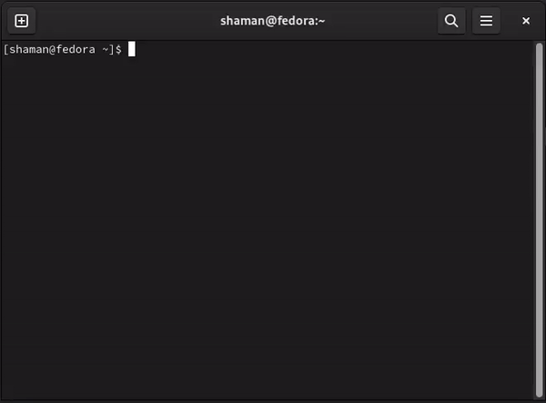
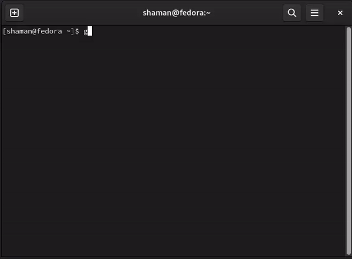

+ [English](https://github.com/codesshaman/sshjet/#English "English")
+ [Русский](https://github.com/codesshaman/sshjet/#Russian "Русский")

### English

### Description

This script automaticly create ssh configuration for connection to many local/remote servers

# Usage

### Installing:

```
git clone https://github.com/codesshaman/sshjet.git
```

``cd sshjet``

``chmod a+x sshjet``

``sudo cp sshjet /usr/local/bin``

### Command for runing:

``sshjet``



### Command for connect to server after settings:

``ssh <your configuration name>``

for example:

``ssh servername``

# Note

If ssh-copy-id not work or you not can login without password, use this commands **ON THE SERVER:**

```
chmod g-w /home/$USER
chmod 700 /home/$USER/.ssh
chmod 600 /home/$USER/.ssh/authorized_keys
```

***

### Russian

### Описание

Данный скрипт автоматически создаёт конфигурацию ssh для подключения ко множеству локальных/удалённых серверов

# Использование

### Установка:

```
git clone https://github.com/codesshaman/sshjet.git
```

``cd sshjet``

```
rm sshjet && mv sshjet_rus sshjet && chmod a+x sshjet
```

``sudo cp sshjet /usr/local/bin``

### Команда для запуска:

``sshjet``



### Команда для подключения к серверу после настройки:

``ssh <имя конфигурации>``

например:

``ssh servername``

# Примечание

Если ssh-copy-id не срабатывает или после работы скрипта залогиниться без пароля не выходит, нужно выподнить следующие команды **НА СЕРВЕРЕ:**

```
chmod g-w /home/$USER
chmod 700 /home/$USER/.ssh
chmod 600 /home/$USER/.ssh/authorized_keys
```
